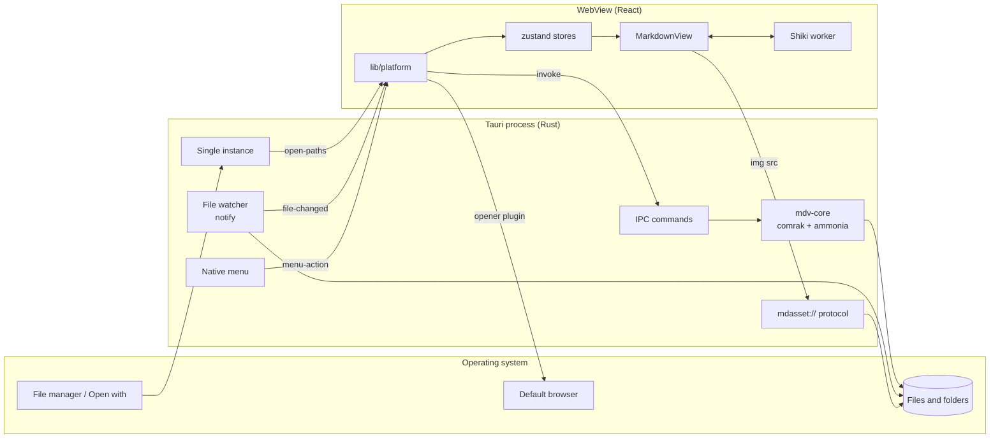
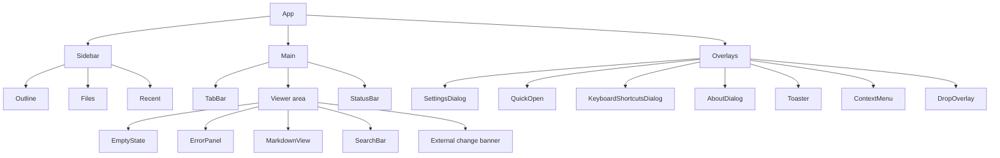
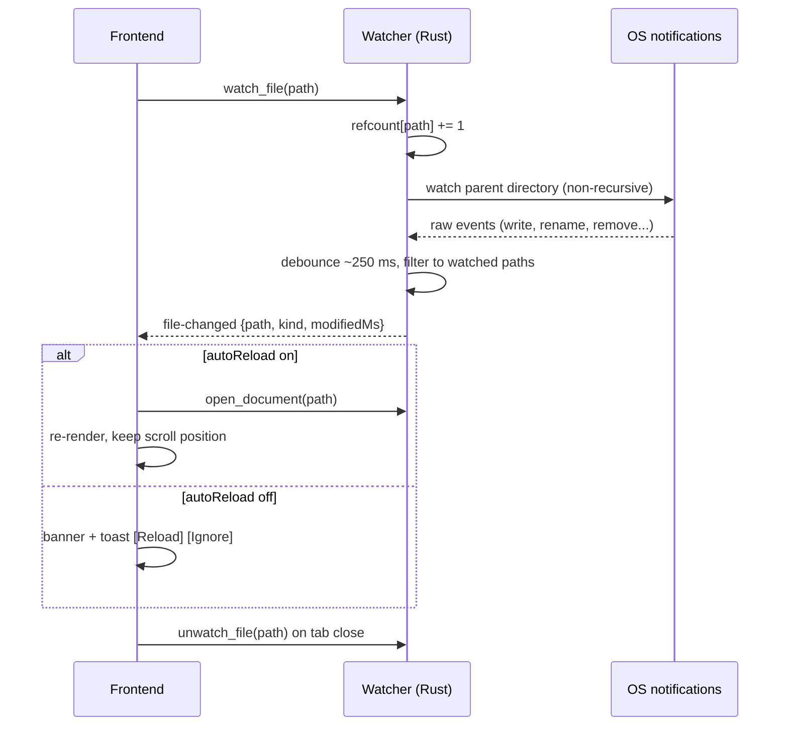
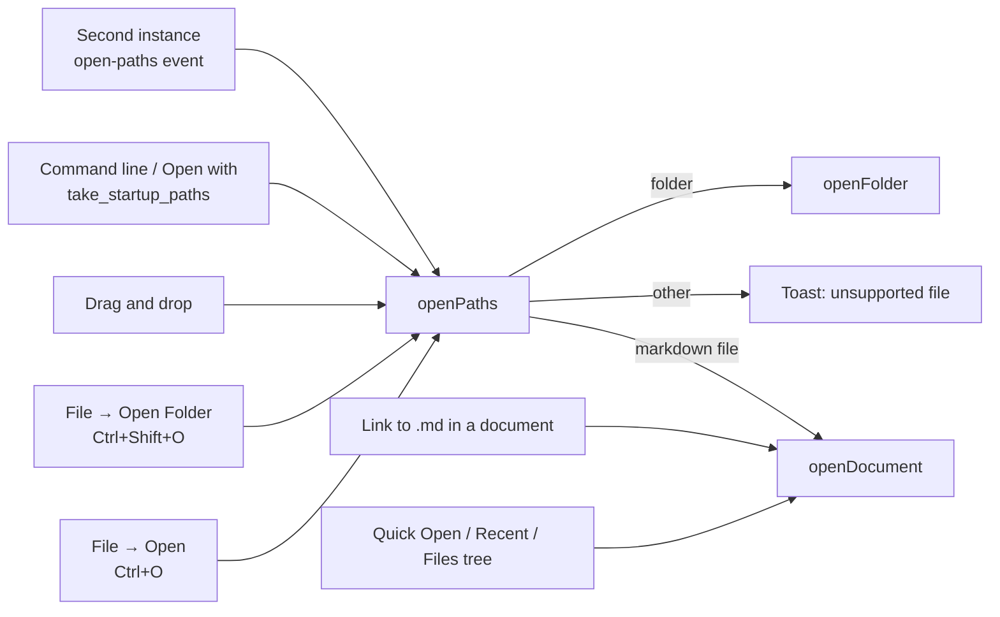
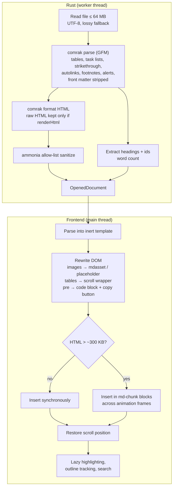
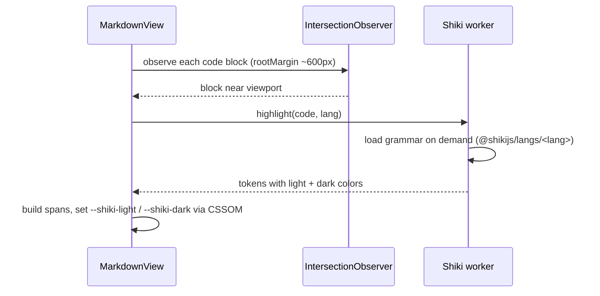
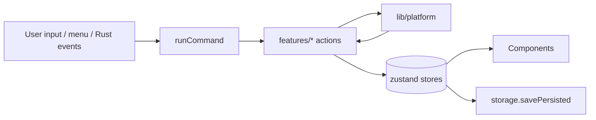

# Architecture

This document describes how Markdown Viewer is put together: the frontend, the
Rust/Tauri backend, how files flow through the app, how Markdown becomes pixels,
and how the app keeps untrusted documents contained.

Guiding principle: **open a Markdown file and make reading it feel exceptionally
good.** The app is a reader, not an editor. That principle drives most of the
decisions below: rendering is optimized for large files, the UI stays calm, and
documents are never allowed to act on the system.

## Contents

- [Overview](#overview)
- [Frontend architecture](#frontend-architecture)
- [Tauri and Rust architecture](#tauri-and-rust-architecture)
- [File handling](#file-handling)
- [Markdown rendering pipeline](#markdown-rendering-pipeline)
- [Large documents](#large-documents)
- [Syntax highlighting](#syntax-highlighting)
- [Search](#search)
- [Table of contents tracking](#table-of-contents-tracking)
- [Security model](#security-model)
- [State management](#state-management)
- [Persistence](#persistence)
- [Build and release](#build-and-release)

## Overview



The app has two halves:

- A **Rust process** that owns everything with side effects: reading files,
  rendering and sanitizing Markdown, watching for changes, serving local images,
  the native menu and window management.
- A **React frontend** in the system WebView (WebView2 on Windows, WebKitGTK on
  Linux) that owns presentation and interaction. It has no direct filesystem
  access.

## Frontend architecture

React 19 + TypeScript (strict, `exactOptionalPropertyTypes`,
`noUncheckedIndexedAccess`) built with Vite 8 and styled with Tailwind CSS 4.
The path alias `@/` maps to `src/`.

### Modules

| Area              | Location                                                                               | Responsibility                                                                                                                                                              |
| ----------------- | -------------------------------------------------------------------------------------- | --------------------------------------------------------------------------------------------------------------------------------------------------------------------------- |
| Platform layer    | `src/lib/platform/`                                                                    | The only code that imports Tauri APIs: IPC wrappers (`ipc.ts`), dialogs, system integration (opener, clipboard, fullscreen, notifications), persistent storage and logging. |
| Errors            | `src/lib/errors.ts`                                                                    | `toAppError()` turns IPC errors into friendly messages. Technical detail is logged, never shown prominently.                                                                |
| Paths             | `src/lib/paths.ts`                                                                     | Cross-platform path helpers (`/` and `\`, drive letters, `..`, percent-decoding, `#hash` splitting).                                                                        |
| Fuzzy matching    | `src/lib/fuzzy.ts`                                                                     | Scoring for Quick Open.                                                                                                                                                     |
| Shortcuts         | `src/lib/shortcuts.ts`                                                                 | Parse, match and format `Mod+Shift+O`-style shortcuts.                                                                                                                      |
| Commands          | `src/app/commands.ts`                                                                  | Registry of every user command (id, label, shortcuts, category, `run`). Used by shortcuts, the native menu and the shortcuts dialog.                                        |
| Startup           | `src/app/bootstrap.ts`                                                                 | Hydrates stores, restores the session, opens startup paths, subscribes to Rust events and drag and drop. Never throws.                                                      |
| Feature actions   | `src/features/{documents,folder,recent,session}/`                                      | All state mutations with side effects (open, reload, close, watch, persist).                                                                                                |
| Stores            | `src/stores/`                                                                          | zustand stores (see [State management](#state-management)).                                                                                                                 |
| Markdown viewer   | `src/components/markdown/`, `src/lib/markdown/`                                        | Inserts sanitized HTML, rewrites images, wraps tables and code blocks, handles links, lightbox and context menu.                                                            |
| Highlighting      | `src/lib/highlight/`                                                                   | Shiki Web Worker and lazy per-block highlighter.                                                                                                                            |
| Search            | `src/lib/search/`, `src/components/search/`                                            | Text search engine and search bar.                                                                                                                                          |
| Outline tracking  | `src/hooks/useActiveHeading.ts`, `src/stores/viewerStore.ts`                           | Active heading and scroll-to-heading.                                                                                                                                       |
| Application shell | `src/app/App.tsx`, `src/components/{layout,sidebar,tabs,settings,quick-open,dialogs}/` | Layout, sidebar (Outline / Files / Recent), tab bar, status bar, empty state, reading mode, dialogs.                                                                        |
| UI primitives     | `src/components/ui/`                                                                   | Button, IconButton, Tooltip, Switch, SegmentedControl, Slider, Kbd, Spinner, Modal, Toaster, ContextMenu.                                                                   |
| Styles            | `src/styles/app.css`, `src/styles/markdown.css`                                        | Tailwind entry, design tokens, bundled fonts, reading typography.                                                                                                           |
| Shared types      | `src/types/index.ts`                                                                   | Domain types; IPC types mirror the Rust structs (camelCase).                                                                                                                |

### Component tree



`App.tsx` stays small: it installs the global shortcut and theme hooks and
composes the layout. Components read narrow slices of stores through selectors
so that, for example, scrolling a document does not re-render the sidebar.

### Commands and shortcuts

Every user action is a `CommandId` (`file.open`, `tab.close`, `view.find`, ...)
in a single registry. Three sources trigger commands:

1. `useGlobalShortcuts()` listens for `keydown` on the window.
2. The native menu emits a `menu-action` event with the command id.
3. UI buttons call `runCommand(id)` directly.

The native menu and the WebView can both receive the same keystroke, so
`runCommand` ignores a repeat of the same command within 150 ms. Browser
defaults that would break the app (`Ctrl+R`/`F5` reloading the WebView,
`Ctrl+P` printing, `Ctrl+F`, `Ctrl+S`, `Ctrl+G`) are suppressed. Errors thrown
by a command are caught and shown as a toast.

`Mod` means `Ctrl` on Windows and Linux; it is abstracted so it can map to `Cmd`
on macOS.

### Design system

`src/styles/app.css` defines CSS custom properties for both themes (`--bg`,
`--fg`, `--accent`, `--code-bg`, `--alert-*`, ...) on `:root` and
`[data-theme='dark']`, and exposes them to Tailwind through `@theme inline`. The
dark theme is designed separately rather than inverted.

`useThemeEffect()` writes the resolved settings to the document element:
`data-theme`, `color-scheme`, `--md-font-size`, `--md-code-font-size`,
`--md-zoom`, `--md-content-width`, `data-reading-font` and `data-line-numbers`.
Changing any appearance setting is therefore a CSS variable update, not a
re-render of the document.

## Tauri and Rust architecture

The Rust side is a Cargo workspace:

- `src-tauri/` — the Tauri application: commands, events, menu, file watcher,
  custom protocol, plugin setup.
- `src-tauri/crates/mdv-core/` — a platform-independent library with no Tauri
  dependency: Markdown rendering, HTML sanitization, filesystem access and image
  protocol helpers. It is fully unit-tested with `cargo test -p mdv-core`.

Keeping the core separate means the security-critical code can be tested
without a WebView and reused by tools such as the `render` example.

### Commands

The frontend calls commands with `invoke(name, args)` using camelCase argument
names. Filesystem commands reject with `FsErrorPayload { kind, message }`, where
`kind` is one of `notFound`, `permissionDenied`, `notAFile`, `notADirectory`,
`unsupportedType`, `tooLarge` or `io`.

| Command              | Arguments                              | Returns          | Notes                                                                                                                                                                                       |
| -------------------- | -------------------------------------- | ---------------- | ------------------------------------------------------------------------------------------------------------------------------------------------------------------------------------------- |
| `open_document`      | `path: string, options: RenderOptions` | `OpenedDocument` | Canonicalizes the path, accepts only `.md`, `.markdown`, `.mdown`, `.mkd`, max 64 MB. Reads, renders and sanitizes off the main thread. Invalid UTF-8 is replaced and flagged with `lossy`. |
| `scan_folder`        | `path: string, showAllFiles: boolean`  | `DirectoryTree`  | Recursive listing (see [Folder mode](#folder-mode)).                                                                                                                                        |
| `check_files`        | `paths: string[]`                      | `boolean[]`      | Whether each path exists and is a file. Used for the recent files list.                                                                                                                     |
| `watch_file`         | `path: string`                         | `void`           | Reference-counted.                                                                                                                                                                          |
| `unwatch_file`       | `path: string`                         | `void`           |                                                                                                                                                                                             |
| `take_startup_paths` | —                                      | `string[]`       | Absolute file/folder paths from the command line; returned once.                                                                                                                            |
| `set_menu_visible`   | `visible: boolean`                     | `void`           | Hides the native menu in reading mode.                                                                                                                                                      |

`OpenedDocument` contains the canonical `path`, `name`, `size`, `modifiedMs`,
the sanitized `html`, the `headings` outline, `wordCount` and `lossy`.

No command accepts arbitrary paths for reading arbitrary content: documents must
be Markdown files and folder scans only return names and paths.

### Events

| Event          | Payload                                               | Emitted when                                                                          |
| -------------- | ----------------------------------------------------- | ------------------------------------------------------------------------------------- |
| `file-changed` | `{ path, kind: 'modified' \| 'removed', modifiedMs }` | A watched file changed (debounced ~250 ms).                                           |
| `open-paths`   | `string[]`                                            | A second instance was launched with files or folders. The existing window is focused. |
| `menu-action`  | `CommandId`                                           | A native menu item was clicked.                                                       |

### Custom protocol: `mdasset`

Local images cannot be loaded with `file://` URLs from the WebView, and exposing
the filesystem through Tauri's generic asset protocol would be too broad.
Instead, Rust registers a dedicated `mdasset` URI scheme:

- The frontend builds URLs with `convertFileSrc(absolutePath, 'mdasset')`
  (`mdasset://localhost/<encoded path>` on Linux,
  `http://mdasset.localhost/<encoded path>` on Windows).
- Rust decodes the path, requires it to be absolute, and serves it only if the
  extension is a supported image type (`png`, `jpg`/`jpeg`/`jfif`, `gif`,
  `webp`, `avif`, `bmp`, `ico`, `svg`), the target is a regular file, and it is
  at most 50 MB.
- Anything else gets an error response. A document therefore cannot use the
  protocol to read, for example, `~/.ssh/id_rsa`.

SVG files are served as `image/svg+xml` but are only ever used as ``,
where browsers do not run SVG scripts.

### Plugins

| Plugin              | Used for                                                                                                  |
| ------------------- | --------------------------------------------------------------------------------------------------------- |
| `dialog`            | Native open-file and open-folder pickers, confirmation dialogs                                            |
| `opener`            | Opening `http`, `https` and `mailto` URLs in the default application; revealing files in the file manager |
| `store`             | Persisting preferences to `preferences.json`                                                              |
| `clipboard-manager` | Copy file path, copy code, copy link                                                                      |
| `notification`      | Notifying about external file changes while the window is unfocused                                       |
| `log`               | Structured logging from Rust and the frontend                                                             |
| `single-instance`   | Forwarding files from a second launch to the running window                                               |
| `window-state`      | Remembering window size and position                                                                      |

There is deliberately **no `fs` plugin** and no shell plugin.

### Capability model

Tauri 2 grants the frontend nothing by default. The capability file in
`src-tauri/capabilities/` applies to the main window only and lists exactly what
it needs:

- the app's own commands listed above;
- `core` event listening, window operations used by the UI (title, focus,
  fullscreen), WebView drag and drop;
- `dialog` open/confirm, `opener` URL opening scoped to `http:`, `https:` and
  `mailto:` plus reveal-in-folder, `store`, `clipboard-manager` write text,
  `notification` and `log`.

Anything not listed is rejected by Tauri before it reaches Rust code.

### File watcher



The watcher observes the **parent directory** non-recursively instead of the
file itself. Many editors save atomically (write a temporary file, then rename
it over the original), which would silently end a watch on the file's inode.
Watching the directory and filtering by path handles those saves as well as
deletions and moves. Watches are reference-counted so that two tabs on the same
file share one watch. A `removed` event marks the tab as deleted and offers to
close it; if the window is unfocused a native notification is shown.

## File handling

All paths into the app end in `openPaths(paths)`, which routes folders to folder
mode, Markdown files to `openDocument`, and anything else to a friendly toast.



- **Open file:** native multi-select picker filtered to Markdown extensions.
- **Drag and drop:** `getCurrentWebview().onDragDropEvent` provides real paths;
  a drop overlay is shown while dragging.
- **Open with / file associations:** the installers register the Markdown
  extensions. The OS starts the app with the file path as an argument; Rust
  collects arguments and the frontend drains them once with
  `take_startup_paths`. Startup paths take precedence over the restored
  session's active tab.
- **Single instance:** if the app is already running, the new process forwards
  its arguments to the existing one (`open-paths` event) and exits; the
  existing window is focused.
- **Tabs:** `openDocument` activates an existing tab for the same path instead
  of opening a duplicate. With **Open files in new tab** off, the active tab is
  replaced. Each open adds the file to recent files, starts watching it and
  updates the window title to `name — Markdown Viewer`.
- **Errors:** a failed open marks the tab as errored and shows a panel with
  **Try Again**, **Remove from Recent** and **Close Tab**.

### Folder mode

`scan_folder` walks the folder recursively and returns a tree:

- hidden entries (names starting with `.`) and `node_modules`,
  `bower_components` and `__pycache__` are skipped;
- symbolic links to directories are not followed, which avoids cycles;
- by default only Markdown files are listed and folders without Markdown files
  are omitted; **Show all files** lists everything (non-Markdown files are shown
  dimmed and can only be revealed in the file manager);
- depth is limited to 16 levels and the scan stops after 20,000 entries, in
  which case `truncated` is set and the UI shows a notice;
- entries are sorted folders first, then by case-insensitive natural order
  (`chapter-2.md` before `chapter-10.md`); unreadable sub-folders are skipped.

## Markdown rendering pipeline

Markdown is rendered in Rust. An early JavaScript pipeline (remark/unified)
took about 11 seconds for a 1 MB document and ran out of memory at 5 MB. comrak
plus ammonia in a release build renders 1 MB in about 0.19 s, 10 MB in about
1.5 s and 25 MB in about 3.7 s on the same machine.



### In Rust (`mdv-core::markdown`)

1. comrak parses the source with GitHub extensions enabled. Front matter
   delimited by `---` is recognized and not rendered.
2. Headings are collected from the same AST, using comrak's own anchor
   algorithm, so each outline entry matches a real element id (duplicates get
   `-1`, `-2` suffixes).
3. comrak formats HTML. When **Render HTML** is off, raw HTML is escaped and
   shown as text; when on, it is passed through only to be sanitized next.
4. ammonia sanitizes the output with an allow-list (see
   [Security model](#security-model)).

The resulting HTML has a stable shape the frontend relies on: headings with an
`id` and a trailing `a.anchor`, `<pre><code class="language-x">`, task list
classes, `section.footnotes`, and `div.markdown-alert.markdown-alert-<type>`.

Changing **Render HTML** re-renders all open documents.

### In the frontend (`src/lib/markdown/`)

1. The HTML string is parsed into a `<template>` element. Template content is
   inert: images do not load and nothing executes while it is prepared.
2. The fragment is rewritten imperatively:
   - **Images:** relative paths are resolved against the document's folder;
     relative and absolute paths become `mdasset` URLs (`file:` URLs are
     already removed by the sanitizer). `https:`
     images are kept unless **Load remote images** is off, in which case a
     placeholder is shown. `http:` images are always replaced by an "insecure
     image blocked" placeholder. All images get `loading="lazy"` and
     `decoding="async"`; an image that fails to load is replaced by an
     accessible placeholder with its alt text.
   - **Tables** are wrapped in a horizontally scrollable container.
   - **Code blocks** are wrapped in a container with a language label and a
     copy button. Each line is wrapped in `span.line` so CSS counters can
     number lines.
3. The fragment is inserted into the viewer and the saved scroll position is
   restored.

Because of the CSP, no inline `style` attributes are ever produced; dynamic
styles are set through the CSSOM (`element.style.setProperty`).

### Links

A single delegated click handler on the viewer decides what a link does:

| Link                                  | Behavior                                                                |
| ------------------------------------- | ----------------------------------------------------------------------- |
| `#fragment`                           | Smooth-scroll to the element within the document                        |
| Relative or absolute path to Markdown | Open in a new tab, then scroll to the fragment if present               |
| Relative path to another local file   | Reveal in the file manager (never opened or executed)                   |
| `http:`, `https:`, `mailto:`          | Open in the default browser/mail client (optionally after confirmation) |
| Anything else                         | Ignored                                                                 |

Middle-click behaves like click. Right-click opens a custom context menu (copy,
copy link, open link, copy image address, open image, select all).

## Large documents

| Size           | Strategy                                                                                                                                                                                                                                                               |
| -------------- | ---------------------------------------------------------------------------------------------------------------------------------------------------------------------------------------------------------------------------------------------------------------------- |
| < ~300 KB HTML | Inserted synchronously                                                                                                                                                                                                                                                 |
| > ~300 KB HTML | Top-level nodes are grouped into `div.md-chunk` blocks and inserted across animation frames with a thin progress bar. Each chunk has `content-visibility: auto` and `contain-intrinsic-size: auto 800px`, so the browser skips layout and paint for off-screen chunks. |
| > 5 MB source  | **Performance mode**: syntax highlighting is disabled and an info banner explains why                                                                                                                                                                                  |
| > 64 MB        | Refused with a "file too large" error                                                                                                                                                                                                                                  |

Rendering happens off the main thread in Rust, so the window stays responsive
while a large file is parsed. Scroll-dependent features (active heading, lazy
highlighting) are all observer-based.

## Syntax highlighting



- Shiki runs in a module Web Worker using the **JavaScript regex engine**, so
  no WebAssembly is needed and the main thread never tokenizes code.
- About 45 languages (plus common aliases such as `js`, `ts`, `sh`, `yml`) are
  mapped to lazily imported grammars. Unknown languages are shown as plain text.
- Tokens are computed for both `github-light` and `github-dark` at once. Each
  token carries both colors as CSS variables, and a stylesheet rule picks one
  based on `data-theme`. Switching themes never re-highlights.
- Blocks over 200 KB or 5,000 lines are skipped. Highlighting can be turned off
  in settings and is off in performance mode.
- Line numbers are pure CSS (counters over `span.line`), toggled by
  `data-line-numbers`.

## Search

- Opened with `Ctrl+F`. Input is debounced (~120 ms).
- `findMatches(root, query, { caseSensitive, limit })` walks the viewer's text
  nodes with a `TreeWalker` and returns DOM `Range`s. It is a pure function with
  unit tests.
- Matches are painted with the **CSS Custom Highlight API**
  (`CSS.highlights`, names `search-match` and `search-current`), so the
  document DOM is never modified. Where the API is unavailable, the current
  match is selected with `window.getSelection()` instead.
- The current match is scrolled to the center. `Enter`/`Shift+Enter` and
  `F3`/`Shift+F3` move between matches. Results are capped at 10,000
  ("10,000+").
- Search re-runs when the document reloads. `Esc` closes the bar, clears the
  highlights and returns focus to the document.
- Matches are found within a single text node; text split across elements (for
  example `foo **bar**`) is not matched as one phrase.

## Table of contents tracking

- Headings come from Rust with the document, so the outline is available
  before the HTML is inserted.
- `useActiveHeading()` observes heading elements with an
  `IntersectionObserver` and updates `activeHeadingId` in the viewer store. No
  work is done per scroll event.
- Clicking an outline entry calls `scrollToHeading(id)`: smooth scrolling
  (instant under `prefers-reduced-motion`), the entry becomes active
  immediately, and focus moves to the heading (`tabindex="-1"`) for screen
  readers and keyboard users.
- The outline scrolls its active entry into view.

## Security model

Markdown documents are untrusted. They may come from the internet, from
repositories, or from an attacker. The design goal is that **no document can
execute code, access native APIs, or read files other than images.**

Defense in depth:

1. **Sanitization (Rust, ammonia).** Allow-listed tags and attributes only.
   `script`, `iframe`, `object`, `embed`, `form`, `style`, `svg`, `math`,
   `link`, `meta` and similar are removed. All event handler attributes and
   `style` attributes are removed. Classes are limited to the renderer's own
   (`anchor`, task list, footnote and alert classes, `language-*` on `code`) so
   raw HTML cannot borrow app styles to fake UI. URL schemes are limited to
   `http`, `https` and `mailto`; `data:` is accepted only for `png`, `jpeg`,
   `gif`, `webp` and `avif` images. Links get `rel="noopener noreferrer"`.
   Comments are stripped. Task list checkboxes are always `disabled`.
2. **Content Security Policy.**

   ```text
   default-src 'self'; script-src 'self'; style-src 'self';
   img-src 'self' data: blob: https: mdasset: http://mdasset.localhost;
   font-src 'self' data:; connect-src ipc: http://ipc.localhost;
   worker-src 'self' blob:; object-src 'none'; base-uri 'none';
   form-action 'none'; frame-src 'none'
   ```

   Even if a script tag survived sanitization, it could not run. The page
   cannot make network requests other than loading images.

3. **Inert preparation.** HTML is prepared inside a `<template>` and inserted
   with DOM APIs; the app never uses `eval` or builds scripts from content.
4. **Least-privilege IPC.** No `fs` or shell plugin. Commands accept only
   Markdown files, folder listings return only names, and the capability file
   allows only what the UI uses. `freezePrototype` is enabled so prototype
   pollution cannot tamper with the IPC bridge.
5. **Scoped local image access.** `mdasset` serves image files only, ≤ 50 MB.
6. **Controlled navigation.** Links never navigate the WebView. External URLs
   go to the OS browser through the opener plugin, which is scoped to `http`,
   `https` and `mailto`; the user can require confirmation. Local non-Markdown
   files are revealed in the file manager, never opened.

See [SECURITY.md](SECURITY.md) for the threat model and vulnerability
reporting.

## State management

State lives in small zustand stores, split by concern. Mutations with side
effects live in `src/features/**` action modules, not in components.

| Kind             | Store / module                    | Contents                                                                                                                                                   |
| ---------------- | --------------------------------- | ---------------------------------------------------------------------------------------------------------------------------------------------------------- |
| UI state         | `uiStore` (`useUi`)               | Sidebar collapsed/width/view, reading mode, open dialogs (search, Quick Open, settings, shortcuts, about), zoom, fullscreen, window width, drag-over state |
|                  | `viewerStore` (`useViewer`)       | Viewer container, headings, active heading, render progress                                                                                                |
|                  | `contextMenuStore`, `toastStore`  | Context menu position and items; toast queue                                                                                                               |
| Document state   | `documentsStore` (`useDocuments`) | Tabs (`DocumentTab`: path, status, rendered document, error, scroll position, external change flag, revision), active tab id, recently closed paths        |
|                  | `folderStore` (`useFolder`)       | Open folder root, tree, status, expanded folders                                                                                                           |
| Persistent state | `settingsStore` (`useSettings`)   | User settings                                                                                                                                              |
|                  | `recentStore` (`useRecent`)       | Up to 20 recent files                                                                                                                                      |
|                  | `features/session`                | Last session snapshot                                                                                                                                      |



`DocumentTab.revision` increments on every successful load and is used as a
render key, so the viewer rebuilds exactly when content changes.

## Persistence

Preferences are stored with the Tauri store plugin in `preferences.json` in the
app's data directory. Writes are debounced. Outside Tauri (`npm run dev`),
`localStorage` is used instead.

| Key        | Contents                                                                                                                                                                                                                                              |
| ---------- | ----------------------------------------------------------------------------------------------------------------------------------------------------------------------------------------------------------------------------------------------------- |
| `settings` | `Settings`: theme, font size, content width, code font size, reading font, restore session, open in new tab, auto-reload, remember recent, show all files, syntax highlighting, line numbers, render HTML, external link behavior, load remote images |
| `ui`       | Sidebar collapsed, sidebar width, sidebar view, zoom                                                                                                                                                                                                  |
| `recent`   | `RecentFile[]` (path, name, opened at); cleared when **Remember recent files** is off                                                                                                                                                                 |
| `session`  | `SessionSnapshot`: open tab paths with scroll positions, active path, open folder                                                                                                                                                                     |

Window size and position are persisted separately by the window-state plugin.
On startup, `bootstrap()` hydrates settings, UI and recent files, restores the
session when enabled, then opens command-line paths.

## Build and release

- **Frontend:** `npm run build` runs `tsc -b` and `vite build` into `dist/`.
  Targets are `es2022`, Chromium 111 and Safari 16 (WebView2 and WebKitGTK).
  Fonts and grammars are bundled; grammars are split into lazily loaded chunks.
- **Desktop:** `npm run tauri:build` builds the frontend, compiles Rust in
  release mode (`lto`, `codegen-units = 1`, `opt-level = "s"`,
  `panic = "abort"`, stripped) and creates bundles:
  - Linux: `.deb` (desktop entry, icon, `text/markdown` association) and
    AppImage in `src-tauri/target/release/bundle/`.
  - Windows: NSIS installer with file associations in
    `src-tauri/target/release/bundle/nsis/`, and the standalone
    `src-tauri/target/release/markdown-viewer.exe` used as the portable build
    (requires WebView2).
- **CI (`.github/workflows/ci.yml`):** on pushes and pull requests, runs lint,
  type checking, Vitest, `cargo test` and a build.
- **Release (`.github/workflows/release.yml`):** on `v*` tags, builds Linux and
  Windows bundles on their native runners and attaches them to a GitHub
  release. Windows installers cannot be cross-built from Linux, which is why
  release builds run in CI.

Versioning follows [Semantic Versioning](https://semver.org/). The version is
kept in `package.json`, `src-tauri/Cargo.toml` and `src-tauri/tauri.conf.json`;
changes are recorded in [CHANGELOG.md](CHANGELOG.md).
