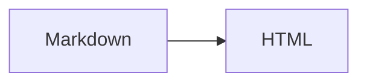
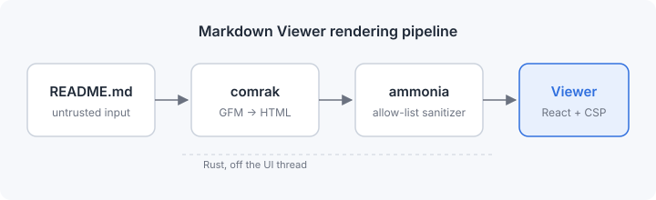

# Markdown Viewer Showcase

This document exercises every feature Markdown Viewer supports. Use it to check
typography, both themes, the outline, search and link handling. The front
matter at the top of this file is hidden from the rendered output.

**Jump to:** [Text](#text) · [Lists](#lists) · [Tables](#tables) ·
[Code](#code) · [Alerts](#alerts) · [Images](#images) · [Links](#links) ·
[Footnotes](#footnotes)

---

## Headings

# Heading level 1

## Heading level 2

### Heading level 3

#### Heading level 4

##### Heading level 5

###### Heading level 6

Hover over a heading to reveal its anchor link. Headings with the same text get
unique ids, so the outline always points at the right one.

## Text

Regular paragraph text should be comfortable to read for long stretches. It
uses a generous line height and a measured line length. Markdown Viewer is a
reader, so the text is the star of the show.

You can write **bold text**, *italic text*, ***bold and italic***,
~~strikethrough~~, and `inline code`. Combinations work too:
**bold with `code` inside** and *italic with a [link](https://example.com)*.

Inline HTML is supported where it is safe: press <kbd>Ctrl</kbd> + <kbd>F</kbd>
to search, <mark>highlight important words</mark>, write H<sub>2</sub>O and
E = mc<sup>2</sup>, or show <ins>inserted</ins> and <del>deleted</del> text.

A line ending with a backslash\
forces a hard line break.

Special characters are escaped: \*not italic\*, \`not code\`, 5 &lt; 7 &amp; 9 &gt; 3.

### Blockquotes

> Simplicity is prerequisite for reliability.
>
> — Edsger W. Dijkstra

> Blockquotes can contain other elements:
>
> - a list item
> - another item with `code`
>
> > And they can be nested.
> >
> > > Even three levels deep.

### Horizontal rules

Three different syntaxes produce the same rule:

---

***

___

## Lists

### Unordered

- Apples
- Oranges
  - Blood oranges
  - Navel oranges
    - Seedless
    - With seeds
- Pears

### Ordered

1. Clone the repository
2. Install dependencies
   1. Node.js packages
   2. Rust toolchain
3. Run the app

Lists can start at any number:

7. Seventh
8. Eighth
9. Ninth

### Task lists

- [x] Render GitHub Flavored Markdown
- [x] Sanitize HTML
- [ ] Render math
- [ ] Render diagrams
  - [x] Nested completed task
  - [ ] Nested open task

### Mixed content in list items

1. **Install the prerequisites.**

   Install Node.js and Rust first. Then verify the versions:

   ```bash
   node --version
   cargo --version
   ```

2. **Start the app.**

   > [!TIP]
   > Use `npm run tauri:dev` for the full desktop experience.

### Definition lists

<dl>
  <dt>Reader</dt>
  <dd>An application that displays documents without modifying them.</dd>
  <dt>Sanitizer</dt>
  <dd>A component that removes unsafe markup from HTML.</dd>
</dl>

## Tables

| Feature          | Supported | Notes                               |
| :--------------- | :-------: | ----------------------------------: |
| Tables           |    Yes    | Left, center and right alignment    |
| Task lists       |    Yes    | Rendered as disabled checkboxes     |
| Footnotes        |    Yes    | With back-references                |
| Math             |    No     | Shown as code                       |
| Mermaid diagrams |    No     | Shown as code                       |

A wide table scrolls horizontally instead of breaking the layout:

| Command | Linux | Windows | Description | Output location | Requires | Notes |
| ------- | ----- | ------- | ----------- | --------------- | -------- | ----- |
| `npm run tauri:build` | `.deb`, AppImage | NSIS installer | Builds release bundles for the current platform | `src-tauri/target/release/bundle/` | Rust, Node.js, platform WebView SDK | Installers must be built on their target platform |
| `npm run build` | `dist/` | `dist/` | Builds the frontend only | `dist/` | Node.js | Used by `tauri:build` |

Tables can contain inline formatting: **bold**, `code`, [links](#tables) and
~~strikethrough~~.

## Code

Inline: use `Array.prototype.map()` to transform arrays.

### TypeScript

```ts
interface Heading {
  level: number;
  text: string;
  id: string;
}

export function buildOutline(headings: readonly Heading[]): string[] {
  return headings.map((h) => `${'  '.repeat(h.level - 1)}${h.text}`);
}
```

### Rust

```rust
use std::path::Path;

/// Returns true when the path has a Markdown extension.
pub fn is_markdown(path: &Path) -> bool {
    path.extension()
        .and_then(|ext| ext.to_str())
        .is_some_and(|ext| matches!(ext.to_ascii_lowercase().as_str(), "md" | "markdown" | "mdown" | "mkd"))
}
```

### Python

```python
from dataclasses import dataclass


@dataclass(frozen=True)
class Document:
    path: str
    words: int

    @property
    def reading_minutes(self) -> int:
        return max(1, round(self.words / 230))
```

### Go

```go
package main

import "fmt"

func main() {
	for i := 1; i <= 3; i++ {
		fmt.Printf("Section %d\n", i)
	}
}
```

### Bash

```bash
#!/usr/bin/env bash
set -euo pipefail

for file in docs/*.md; do
  echo "Opening ${file}"
  markdown-viewer "$file"
done
```

### JSON

```json
{
  "theme": "system",
  "fontSize": 17,
  "contentWidth": "medium",
  "syntaxHighlighting": true
}
```

### YAML

```yaml
name: CI
on: [push, pull_request]
jobs:
  test:
    runs-on: ubuntu-latest
    steps:
      - uses: actions/checkout@v4
      - run: npm ci && npm test
```

### HTML and CSS

```html
<article class="markdown-body">
  <h1 id="hello">Hello</h1>
  <p>Rendered safely.</p>
</article>
```

```css
.markdown-body {
  max-width: var(--md-content-width);
  line-height: 1.7;
  font-size: calc(var(--md-font-size) * var(--md-zoom));
}
```

### SQL

```sql
SELECT path, COUNT(*) AS opens
FROM recent_files
WHERE opened_at > CURRENT_DATE - INTERVAL '7 days'
GROUP BY path
ORDER BY opens DESC
LIMIT 10;
```

### Diff

```diff
- const limit = 1_000;
+ const limit = 10_000;
  export function findMatches() {}
```

### A very long line

```js
const message = 'This line is intentionally very long so that you can check that code blocks scroll horizontally instead of wrapping or overflowing the page layout, and that the copy button still copies the entire line without truncation.';
```

### Without a language

```
Plain preformatted text.
    Indentation is preserved.
No syntax highlighting is applied.
```

### Unknown language

```brainfuck
++++++++[>++++[>++>+++>+++>+<<<<-]>+>+>->>+[<]<-]>>.
```

### Math and diagrams (shown as code)

```math
e^{i\pi} + 1 = 0
```



### Indented code block

    function indented() {
      return 'four spaces';
    }

## Alerts

> [!NOTE]
> Useful information that users should know, even when skimming content.

> [!TIP]
> Helpful advice for doing things better or more easily.

> [!IMPORTANT]
> Key information users need to know to achieve their goal.

> [!WARNING]
> Urgent info that needs immediate user attention to avoid problems.

> [!CAUTION]
> Advises about risks or negative outcomes of certain actions.

## Collapsible sections

<details>
<summary>Click to expand</summary>

Hidden content can contain **Markdown**, lists and code:

- One
- Two

```ts
console.log('Hello from inside <details>');
```

</details>

<details open>
<summary>This one starts open</summary>

Use the `open` attribute to expand a section by default.

</details>

## Images

A local SVG diagram, referenced with a relative path:



A missing image shows an accessible placeholder with its alt text:


A remote HTTPS image (hidden when **Load remote images** is off):


A linked image:

[](https://v2.tauri.app/)

Click any image to open it in the lightbox. Press <kbd>Esc</kbd> to close it.

## Links

- External link: [Tauri](https://v2.tauri.app/) opens in your default browser.
- Link with a title: [Rust](https://www.rust-lang.org/ "The Rust programming language")
- Autolinks: <https://github.com> and www.example.com and https://example.org
- Email: <hello@example.com> and [mail link](mailto:hello@example.com)
- Heading anchor: [back to Tables](#tables)
- Relative Markdown link: [Getting started](docs/getting-started.md) opens in a new tab.
- Relative Markdown link with a fragment: [API authentication](docs/api.md#authentication)
- Link to a local non-Markdown file: [diagram source](images/diagram.svg) is revealed in its folder, not opened.
- Reference-style link: [the CommonMark spec][commonmark]

[commonmark]: https://spec.commonmark.org/ "CommonMark specification"

## Footnotes

Markdown Viewer renders Markdown in Rust[^rust]. HTML is sanitized with an
allow-list[^sanitizer], and footnotes link back to where they were
referenced[^backref].

[^rust]: Using the comrak crate, which implements GitHub Flavored Markdown.

[^sanitizer]: Using the ammonia crate. Scripts, frames, styles and event
    handlers are removed.

[^backref]: Click the arrow to jump back.

## Long content

The sections below give the outline and scroll tracking something to work with.

### Section A

Lorem ipsum dolor sit amet, consectetur adipiscing elit. Integer posuere erat a
ante venenatis dapibus. Maecenas faucibus mollis interdum. Donec ullamcorper
nulla non metus auctor fringilla. Vestibulum id ligula porta felis euismod
semper.

### Section B

Curabitur blandit tempus porttitor. Nullam quis risus eget urna mollis ornare
vel eu leo. Cras mattis consectetur purus sit amet fermentum. Aenean lacinia
bibendum nulla sed consectetur. Etiam porta sem malesuada magna mollis euismod.

### Section C

Sed posuere consectetur est at lobortis. Cum sociis natoque penatibus et magnis
dis parturient montes, nascetur ridiculus mus. Donec id elit non mi porta
gravida at eget metus. Fusce dapibus, tellus ac cursus commodo.

---

*End of showcase.* Continue with the [getting started guide](docs/getting-started.md)
or test the sanitizer with [security-test.md](security-test.md).
